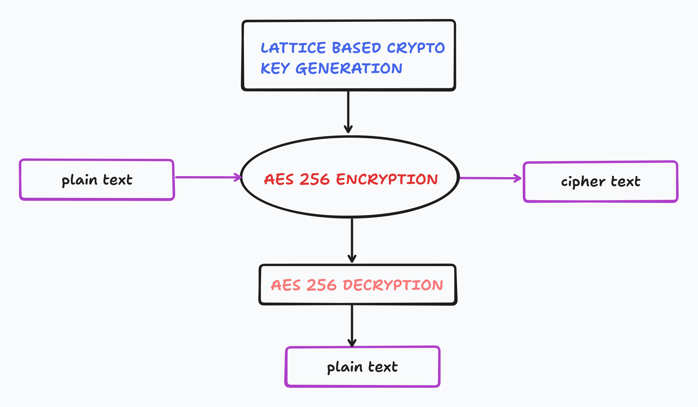

# Post-Quantum Cryptography Benchmarking Tool

A comprehensive benchmarking framework designed to evaluate the performance trade-offs between Classical Cryptography and Post-Quantum Cryptography (PQC). This tool simulates the migration to quantum-safe standards by implementing a **Hybrid Cryptographic Model** (KEM + DEM).



## Overview

As quantum computing advances, traditional public-key algorithms (RSA, ECC) face existential threats. This project quantifies the computational cost of migrating to Quantum-Resistant algorithms. It measures Key Generation, Encapsulation (Key Exchange), and Data Encryption performance across varying file sizes (10KB - 100MB).

## Algorithms Implemented

| Category | Algorithm | Implementation | Purpose |
| :--- | :--- | :--- | :--- |
| **Symmetric (Classical)** | **AES-256-CBC** | OpenSSL `EVP` | Large data encryption baseline. |
| **Asymmetric (Classical)** | **RSA-2048** | OpenSSL `RSA` | Benchmark for current standard Key Exchange. |
| **PQC (Simulated)** | **Lattice Simulation** | Custom C++ | Mathematical simulation of Lattice operations ($A \cdot s + e$). |
| **PQC (Real)** | **ML-KEM-768 (Kyber)** | `liboqs` | **NIST Standard** Post-Quantum Key Encapsulation. |

## Prerequisites

*   **OS**: Linux / WSL (Ubuntu recommended)
*   **Compiler**: `g++` (GCC) or `clang`
*   **Build Tools**: `cmake`, `ninja-build` or `make`
*   **Libraries**:
    *   **OpenSSL** (v3.0+)
    *   **liboqs** (Open Quantum Safe)

### Installing Dependencies (Ubuntu/WSL)

```bash
# 1. Install Build Tools & OpenSSL
sudo apt-get update
sudo apt-get install -y build-essential libssl-dev cmake ninja-build git

# 2. Install liboqs (Post-Quantum Library)
git clone -b main https://github.com/open-quantum-safe/liboqs.git
cd liboqs
mkdir build && cd build
cmake -GNinja .. -DBUILD_SHARED_LIBS=ON -DCMAKE_INSTALL_PREFIX=/usr/local
ninja
sudo ninja install
sudo ldconfig
```

## Compilation & Usage

1.  Navigate to the source directory:
    ```bash
    cd quantum_crypto
    ```

2.  Compile the project linking OpenSSL and liboqs:
    ```bash
    g++ main.cpp aes.cpp perf_analysis.cpp simulate_lbc.cpp rsa_kem.cpp pqc_hybrid.cpp \
        -o quantum_crypto -lssl -lcrypto -loqs
    ```

3.  Run the benchmark:
    ```bash
    ./quantum_crypto
    ```

## Performance Metrics

The tool generates a detailed report comparing:
1.  **Key Exchange Latency**: RSA vs. Kyber (KeyGen, Encaps, Decaps).
2.  **Throughput**: Encryption/Decryption speeds for 10KB, 10MB, and 100MB payloads.
3.  **Overhead**: The specific cost added by the Post-Quantum handshake in a Hybrid workflow.

## **Contributors**

<table>
  <tr>
    <td align="center">
      <br/>
      <a href="https://github.com/SajeevSenthil"><b>Sajeev Senthil</b></a>
    </td>
        <td align="center">
      <br/>
      <a href="https://github.com/hari23228"><b>Hari Varthan</b></a>
    </td>
    <td align="center">
      <br/>
      <a href="https://github.com/FightKlub"><b>Dennis Jerome Richard </b></a>
    </td>
    <td align="center">
      <br/>
      <a href="https://github.com/Jopan"><b>Joseph Binu George</b></a>
    </td>
  </tr>
</table>


